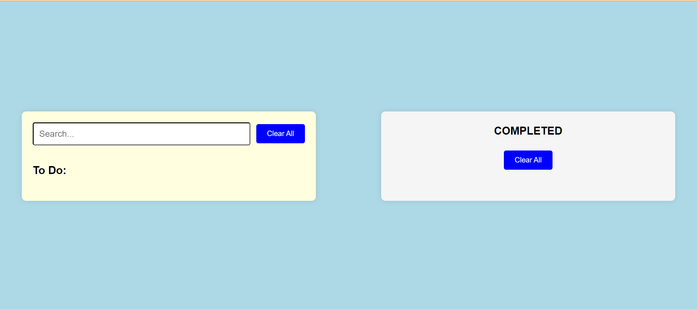
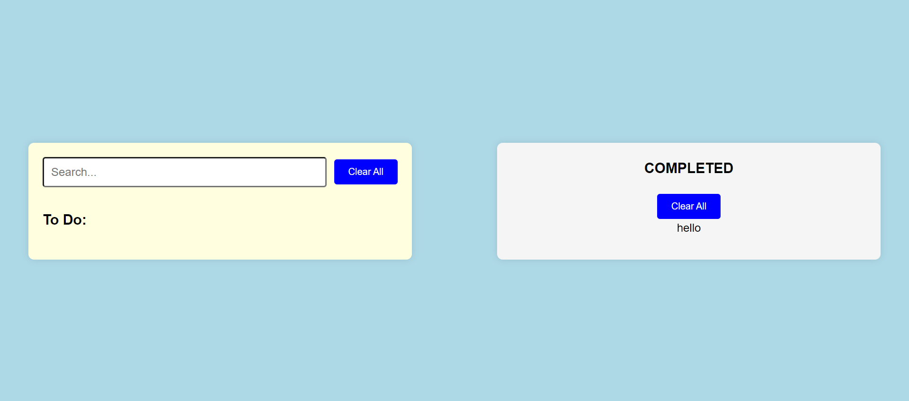

# To-Do List Application

This project is a simple To-Do List application built with HTML, CSS, and JavaScript. It allows users to add, move, and delete tasks between the "To Do" and "Completed" sections.

## Features

- **Add New Task**: Type in a task and press Enter to add it to the "To Do" list.
- **Delete Task**: Each task has a delete button to remove it.
- **Move Task to Completed**: Press the "Right" button to move a task to the "Completed" section.
- **Clear All Tasks**: There are buttons to clear all tasks in both the "To Do" and "Completed" sections.

## Project Structure

- `index.html`: The main HTML file that contains the structure of the to-do list.
- `text.css`: The CSS file used to style the to-do list.
- `text.js`: The JavaScript file that controls the functionality of adding, deleting, and moving tasks.

## Technologies Used

- **HTML**: For the structure of the application.
- **CSS**: For styling the application (e.g., layout, colors, fonts).
- **JavaScript**: For interactivity and functionality (e.g., task addition, task deletion, task movement).

## How to Run the Project

1. Clone this repository to your local machine.
   ```bash
   git clone <repository-url>

## Screenshots

1. **Initial View**: 


2. **Adding a Task**: 


3. **Task Moved to "Completed" Section**: 



4. **Clear All Tasks**: 


## License
This project is open-source and available under the MIT License.
